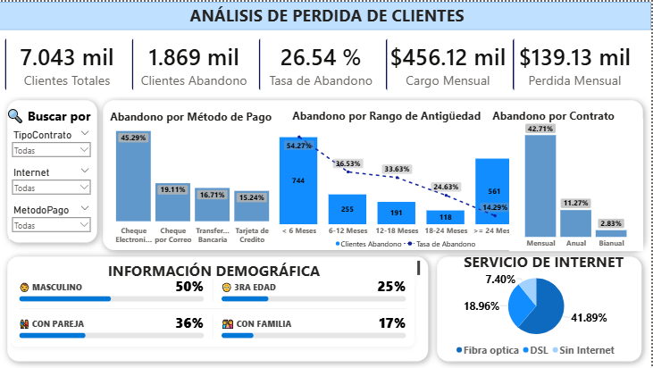
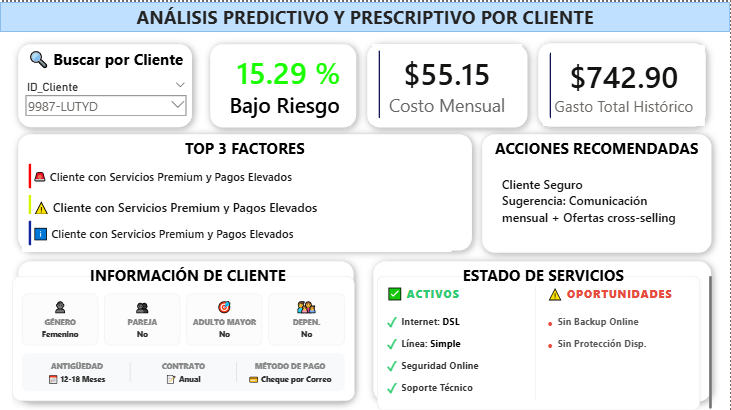

# 📉 Telecom Churn Prediction: End-to-End Power BI & ML Solution

## 💼 Business Case & Impact
**El Problema:** La compañía de telecomunicaciones enfrenta una tasa de abandono crítica (**Churn Rate**) del **26.54%**, lo que representa una **pérdida mensual de $139,130 USD**. La organización operaba de forma reactiva, sin visibilidad sobre qué clientes estaban en riesgo ni por qué.

**La Solución:** Este proyecto implementa un sistema de Business Intelligence integral que no solo diagnostica el pasado, sino que **predice el futuro**. Integra un modelo de Machine Learning para calcular la probabilidad de fuga individual y prescribir estrategias de retención automatizadas, protegiendo potencialmente más de **$450k en facturación mensual recurrente**.

---

## 🚀 Características del Dashboard 

El reporte se divide en dos módulos estratégicos diseñados para diferentes usuarios:

### 1. Módulo Estratégico (Descriptivo)
Diseñado para gerentes. Responde a la pregunta: *"¿Dónde estamos perdiendo dinero?"*
* **KPIs Financieros en Tiempo Real:** Visualización de pérdidas monetarias ($139k) y clientes fugados (1,869).
* **Análisis de Cohortes:** Identificación crítica de que los clientes nuevos (<6 meses) representan la mayor fuga (744 usuarios).
* **Detección de Fricción:** Descubrimiento de que el método de pago "Cheque Electrónico" tiene una tasa de fallo/abandono del 45.29%.

### 2. Módulo Táctico (Predictivo y Prescriptivo)
Diseñado para el equipo de retención/Call Center. Responde a: *"¿A quién llamo hoy y qué le ofrezco?"*
* **Scoring de Riesgo Individual:** Cada cliente tiene un puntaje de probabilidad (ej. *15.29% Bajo Riesgo*) calculado mediante ML.
* **Motor de Recomendación:** Sugiere acciones específicas ("Ofertas Cross-selling" vs "Llamada de Retención") basadas en el perfil del cliente.
* **Análisis de Oportunidades:** Detecta "Gaps" en la cuenta (ej. Cliente sin Backup Online o sin Protección de Dispositivo) para aumentar el "Lock-in".

---

## 📷 Galería del Proyecto

### 1. Visión General (Diagnóstico)
> *Identificación de patrones de fuga masiva, KPIs financieros y segmentación por riesgo.*

 

### 2. Ficha de Cliente (Predicción con IA)
> *Perfil 360° del cliente individual con alertas de riesgo, score de churn y acciones recomendadas (Prescriptivo).*

---

## 🛠️ Arquitectura Técnica y Stack

### 1. Ingeniería de Datos (ETL con Power Query / M)
El proceso de transformación fue crítico para garantizar la calidad del dato antes del modelado:
* **Manejo de Valores Nulos y Tipos de Dato:** Se identificó y corrigió un desafío de integridad en la columna `TotalCharges`, la cual contenía cadenas vacías en clientes nuevos (`tenure = 0`). Se aplicó lógica condicional para imputar estos valores y convertir el tipo de dato a decimal, asegurando la consistencia de los cálculos financieros.
* **Feature Engineering (Discretización):** Creación de atributos categóricos mediante agrupación (Binning) para variables continuas, generando rangos analíticos para `Antigüedad` (e.g., "0-6 Meses") y `MonthlyCharges`.
* **Estandarización Semántica:** Normalización de metadatos y mapeo de valores categóricos (EN $\to$ ES) para asegurar una experiencia de usuario localizada.

### 2. Modelado de Datos (Star Schema)
Se diseñó un modelo dimensional en esquema de estrella para optimizar el rendimiento de las consultas DAX y simplificar el mantenimiento:
* **Tablas de Hechos (Facts):**
    * `Fact_Telco_Churn`: Tabla central con el historial transaccional de los 7,043 clientes.
    * `Fact_Predicciones`: Tabla desacoplada que almacena los outputs del modelo de ML (Score, Risk Label, Top Factors).
* **Tablas de Dimensiones (Dims):**
    * `Dim_Demografica`: Atributos de perfilado (Género, Pareja, Dependientes, Senior).
    * `Dim_Servicios`: Detalles de conectividad (Fibra/DSL) y servicios adicionales (Streaming, Seguridad).
    * `Dim_InfoCuenta`: Métodos de pago, tipo de contrato y facturación.
* **Gestión de Medidas:** Implementación de una tabla dedicada `tabla_medidasDAX` para centralizar la lógica de negocio y mantener el orden del modelo.

### 3. Machine Learning & Lógica de Negocio

* **Scoring Probabilístico:** Entrenamiento de modelo de clasificación (Python) para generar un `Churn_Score` (0-100%) por `Cliente_ID`.
* **Segmentación de Riesgo (Thresholding):** Definición de umbrales lógicos para categorizar la urgencia: *Bajo (<40%)*, *Medio (40-69%)* y *Alto (>70%)*.
* **Arquetipos de Fuga (Business Logic):** Post-procesamiento para asignar etiquetas de perfil complejas (e.g., *P1: Fuga de Alto Valor*, *P3: Senior Vulnerable*) basándose en combinaciones multivariables (Fibra + Cheque + Contrato Mensual).

### 4. Visualización Avanzada & UX
Diseño centrado en la usabilidad y la reducción de carga cognitiva:
* **Optimización Visual:** Reemplazo de gráficos circulares (Pie Charts) por "Tarjetas de Información" (Info Cards) para variables demográficas binarias, optimizando el espacio en el lienzo.
* **Navegación Dinámica:** Implementación de marcadores y navegación de páginas para estructurar el relato de "General a Específico".
* **Alertas Visuales:** Uso de formato condicional (Semáforos y KPIs) para enfocar la atención inmediata en los segmentos críticos de pérdida financiera.

## 💡 Insights Clave Descubiertos

> *Los datos cuentan una historia clara sobre la retención:*

* 🚩 **El "Valle de la Muerte":** Los primeros 6 meses son críticos; si el cliente sobrevive el primer año, la tasa de abandono cae drásticamente (del 54% al 11%).
* 🚩 **El Problema de la Fibra:** Los usuarios de Fibra Óptica tienen una tasa de abandono mucho mayor (41.89%) que los de DSL, sugiriendo problemas técnicos o de precio en ese servicio específico.
* 🚩 **Contratos:** Los contratos "Mes a Mes" son el predictor más fuerte de fuga (42.71% vs 2.83% en contratos bianuales). La estrategia prescriptiva debe enfocarse en migrar estos usuarios a contratos anuales.

---

### 👤 Autor

**Stephany Marilyn Toribio Alvarado**
* *Data Scientist & Analyst*
* Expertise: Business Intelligence | Machine Learning | Strategic Planning
* [LinkedIn](https://www.linkedin.com/in/stephany-marilyn-toribio-alvarado-47080b303/) | [Portafolio](https://stephany-toribio.github.io/MWeb/)
